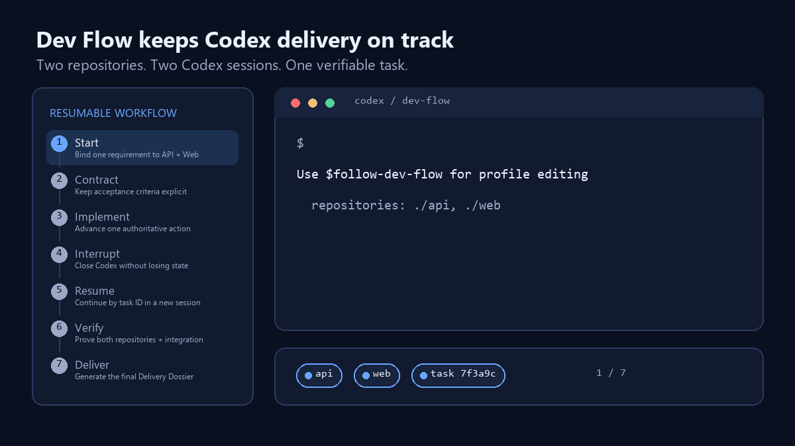

# Dev Flow Orchestrator

Version 0.3.0 replaces fixed test-and-review loops with task-scoped adaptive
assurance. Every task owns an immutable preflight origin and a roll-forward
change manifest. The closed `dev-flow-assurance-policy/0.3.0` derives only the
repository, integration, documentation, manual-evidence, and independent-review
obligations justified by the current contract, source-confirmed impact closure,
and eight closed risk triggers. `degraded`, `partial`, or unknown impact is
handled conservatively. `assurance.dispatch` exposes exactly one eligible
obligation, records absolute attempts, and never resets authority on restart.

Index-exact snapshots include canonical stage 0–3 entries, modes, object IDs,
object format, and worktree-specific Git administration identity. Source actions
must claim every observed changed path exactly. Unclaimed ambient drift,
unmerged stages, unresolved causal triage, impact gaps, missing required
evidence, or exhausted budgets prevent `DONE`. Independent review reports
structured `introduced`, `affected`, `pre-existing`, `out-of-scope`, or
`unknown` findings; only current blocking causal findings schedule task rework.
Disjoint evidence can be reused when its slice and governing inputs remain
current.

[简体中文](README_CN.md) · [Installation](INSTALL.md) ·
[Roadmap](ROADMAP.md) · [Architecture](ARCHITECTURE.md) ·
[Contributing](CONTRIBUTING.md)

**Keep Codex development tasks resumable, verifiable, and aligned across
repositories.**

Codex is excellent at implementing code, but a long-running task can lose its
place between sessions, drift from its acceptance criteria, or finish without
complete verification. Dev Flow adds a local workflow controller that keeps
the requirement, current action, repository state, and delivery evidence
together from start to handoff.



With Dev Flow, you can:

- resume the same task in a new Codex session instead of reconstructing context;
- coordinate one requirement across an exact set of 1–8 Git repositories;
- keep implementation tied to explicit, stable acceptance criteria;
- require structured verification and independent review evidence; and
- end every non-cancelled task with a readable `DONE` or `INCOMPLETE` Delivery
  Dossier.

## 60-second example

Give Codex one requirement and the worktrees it must coordinate:

```text
Use $follow-dev-flow to implement user profile editing across:
- /path/to/backend
- /path/to/frontend

Acceptance criteria:
1. Users can update their display name.
2. Invalid names are rejected.
3. Backend, frontend, and integration tests pass.
```

Dev Flow turns it into one resumable path:

```text
Requirement -> Impact analysis -> Plan -> Implementation -> Verification
            -> Independent review -> Delivery Dossier
```

Close Codex at any point. In a new session, resume the exact task by ID:

```text
Use $follow-dev-flow to resume task <task-id>.
```

## Local read-only Web UI

Dev Flow 0.3.0 includes a local task cockpit as another presentation surface of
the same installed product. It has no separate WebUI version, package, plugin,
state namespace, or compatibility line. Start it explicitly in the foreground:

```sh
dev-flow --data-dir <controller-data-root> web
```

The command binds only numeric `127.0.0.1`, selects an ephemeral port by
default, and prints one JSON startup receipt containing a browser URL. The
256-bit process-local access token is carried in the URL fragment, consumed
into browser memory, and removed from the visible URL. The server does not open
a browser, daemonize, enable CORS, load remote resources, emit telemetry, or
persist browser selections or credentials.

Task inventory and ordinary detail are derived only from persisted 0.3.0 state,
so they remain immediate when a repository is unavailable and do not run Git.
Use **Observe live** only for the selected task when current action readiness or
repository health is needed. Live observation uses the existing bounded
read-only aggregate snapshot, admits one capture process-wide, and never
creates a task binding or changes controller or repository state.

## Install in one command

Dev Flow 0.3.0 currently supports macOS with Git, Python 3.9–3.14, and Codex
plugin/Hook support:

```sh
curl -fsSL https://raw.githubusercontent.com/Innocent-children/dev-flow-orchestrator/main/scripts/install.sh | sh
```

The installer checks the host, clones or updates the source, validates the
package, safely merges the personal marketplace entry, installs a missing
plugin, upgrades an older installation, or repairs the current version by
reinstalling it. It then prints an installation receipt with the action,
versions, touched directories, and a first prompt. It treats `main` as the
authoritative source ref:
fresh installs select it explicitly, while an existing source must have the
expected origin, a clean attached `main`, and history that can only fast-forward
to the fetched commit. Other branches, local-ahead or diverged history, and
reported local changes stop without an automatic switch, reset, stash, or
clean. The fast-forward also refuses to overwrite an ignored local path, while
unrelated ignored content remains in place. If you prefer to inspect every
step before running it, review
[scripts/install.sh](scripts/install.sh) or follow the [manual installation
guide](INSTALL.md).

The success receipt uses a neon terminal palette when standard output is an
interactive terminal. Redirected output, `TERM=dumb`, or `NO_COLOR` produces
the same receipt without ANSI color codes.

After installation, start a new Codex task, review and trust the installed Hook
in `/hooks`, then try:

```text
Use $follow-dev-flow to start a lite task in this repository for:
<your requirement>
```

## Why not just use a prompt, AGENTS.md, or OpenSpec?

These tools solve different parts of the problem and can be used together.
This comparison describes their primary role, not a benchmark:

| Delivery concern | Direct Codex | `AGENTS.md` | OpenSpec | Dev Flow |
|---|---|---|---|---|
| Cross-session state | Conversation/task context | Repository guidance | Versioned change artifacts | Persisted controller task |
| Multi-repository coordination | Prompt-defined | Not its primary role | Specification scope | Immutable 1–8 repository set |
| Acceptance criteria | Prompt-defined | Guidance only | Specification artifacts | Stable IDs bound to runtime evidence |
| Verification | Agent-driven | Can prescribe commands | Spec/change validation | Per-repository and integration coverage |
| Final delivery record | Conversation summary | None | Change archive | Delivery Dossier with freshness and gaps |

Dev Flow does not replace instructions or specifications. It provides the
runtime state, transition rules, and evidence trail that connect them to a
delivery outcome.

## Three common delivery failures it prevents

| Scenario | Requirement | Common failure mode | Dev Flow path | Delivery result |
|---|---|---|---|---|
| Cross-session recovery | Continue a feature after Codex is closed | The next session reconstructs stale or incomplete context | Persist the contract, artifacts, decisions, and authoritative next action; resume by task ID | Work continues from the recorded state with stale bindings rejected |
| Multi-repository change | Update an API and its frontend in one requirement | One repository is verified while the other or their integration is missed | Bind the exact repository set at start and require member plus integration results | The Dossier shows evidence for every member and the combined behavior |
| Verification rework | Fix a change after tests or review fail | The task is declared complete after an informal retry | Route failure through bounded rework and require fresh verification/review evidence | The outcome is `DONE` only with current proof, otherwise explicitly `INCOMPLETE` |

## What Dev Flow controls

Dev Flow 0.3.0 provides complete personal delivery over one exact canonical set of one to
eight local Git worktrees:

- a structured, versioned delivery contract with stable acceptance-criterion
  IDs, scope, constraints, risks, non-goals, and open questions;
- six official workflows: `lite`, `feature`, `bugfix`, `investigation`,
  `refactor`, and `full`;
- append-only contract revisions and attributable criterion or review-
  assurance waivers;
- typed artifacts with producer metadata, contract binding, per-repository
  snapshots, aggregate repository-set bindings, input lineage, digests, and
  derived freshness;
- adaptive assurance obligations with absolute execution and source-rework
  budgets plus explicit `DONE` and `INCOMPLETE` dossier outcomes;
- optional OpenSpec, codebase-memory, and independent-review driver paths
  with explicit degraded or unavailable results;
- resumability across Codex sessions from any member repository through the
  same controller and task ID.

The supported execution boundary is one task, one immutable repository set,
one current action, and one Codex executor. Repository topology is independent
of workflow depth: every official workflow accepts either one member or an
exact set of up to eight members. All worktrees are prepared and owned by the
user. The controller does not create or switch branches/worktrees, coordinate
parallel agents, commit or publish Git changes, dispatch external CI, or open
pull requests. Slice-equivalent evidence may be reused only when its governing
inputs and impact closure remain current and disjoint from later task-owned
changes. There are no external release effects; any CI, PR, or release follow-up is user-owned
outside Dev Flow. A dirty worktree and detached `HEAD` are supported when
every supplied path is the exact root of an initialized non-bare Git worktree.

## Requirements

- macOS;
- Python 3.9–3.14;
- Git and one to eight target worktrees with existing `HEAD` commits;
- Codex with plugin and Hook support.

Runtime code uses only the Python standard library. OpenSpec,
codebase-memory, and an independent reviewer are optional workflow
capabilities; their absence is recorded explicitly and never silently raises
the assurance level.

## Manual installation

For a new personal marketplace, if you do not use the one-command installer:

```sh
mkdir -p "$HOME/plugins"
git clone --branch main --single-branch \
  git@github.com:Innocent-children/dev-flow-orchestrator.git \
  "$HOME/plugins/dev-flow-orchestrator"

cd "$HOME/plugins/dev-flow-orchestrator"
python3 -I -S scripts/validate_package.py

mkdir -p "$HOME/.agents/plugins"
cp templates/personal-marketplace.example.json \
  "$HOME/.agents/plugins/marketplace.json"

codex plugin add dev-flow-orchestrator@personal
```

Run the `cp` command only when
`~/.agents/plugins/marketplace.json` does not exist. Otherwise merge
`templates/marketplace-entry.json` into its `plugins` array. Start a new Codex
task after installation, open `/hooks`, and review and trust the installed
Hook definition. See [INSTALL.md](INSTALL.md) for replacement installs,
installed verification, troubleshooting, and removal.

## Uninstall in one command

Finish or cancel active Dev Flow tasks, then run:

```sh
curl -fsSL https://raw.githubusercontent.com/Innocent-children/dev-flow-orchestrator/main/scripts/uninstall.sh | sh
```

The uninstaller removes the Codex plugin, its personal marketplace entry, and
the clean installer-managed source checkout. It refuses to delete a source
checkout with local changes, ignored paths, local-only commits, an unexpected
origin, or a different branch. External Dev Flow task data is always preserved.
To retain the source checkout, pass `--keep-source`:

```sh
curl -fsSL https://raw.githubusercontent.com/Innocent-children/dev-flow-orchestrator/main/scripts/uninstall.sh | sh -s -- --keep-source
```

## Choose a workflow

Daily use goes through `$follow-dev-flow`.

| Workflow | Delivery path | Assurance budget |
|---|---|---|
| `lite` | preflight → implementation → verification → dossier | 2 verification attempts |
| `feature` | impact → repository-backed plan → implementation → documentation → verification → independent review → dossier | 2 verification and 2 review attempts |
| `bugfix` | diagnosis → repository-backed fix plan → implementation → documentation → regression verification → independent review → dossier | 2 verification and 2 review attempts |
| `investigation` | impact → investigation report → verification → dossier | 2 verification attempts; no fabricated implementation |
| `refactor` | structural impact → invariant-backed plan → implementation → documentation → verification → independent review → dossier | 2 verification and 2 review attempts |
| `full` | complete impact and planning → implementation → documentation → verification → independent review → dossier | 3 verification and 3 review attempts |

Every official workflow begins with bounded, read-only Git preflight over the
complete repository set and finalizes every non-cancelled result through one
aggregate Delivery Dossier 0.3.0. `dev-flow-workflow/0.3.0` definitions declare cancellation
availability through `cancel.stages`; official workflows enable it for the
normal majority of non-terminal stages and exclude every `delivery.finalize`
stage. A custom workflow must be a valid `dev-flow-workflow/0.3.0` JSON or YAML document
selected by absolute path. Its identity binds the selector, schema, and
canonical document. Repository count never selects or changes a workflow.

If Codex confirms that the accepted requirement cannot be satisfied by the
task's immutable repository set, it stops the projected action and reports
that the exact task remains active. Cancellation still requires explicit user
authority for that task. Codex reports it as ended only after the controller
returns `done: true`, `status: CANCELLED`, and `current_node: cancelled`; a
failed or unavailable cancellation never substitutes another repository or
claims a terminal result.

## Start and resume

Ask Codex to start a task with an explicit workflow, delivery contract, and
one or more user-prepared repository roots:

```text
Use $follow-dev-flow to start one feature task across these prepared worktrees:
/absolute/path/to/api-repository
/absolute/path/to/client-repository

Create a structured delivery contract for:
<what must be delivered>
```

The CLI repeats `--repo` once per member. One occurrence creates a one-member
repository set through the same admission and evidence path:

```text
<ctl> start --requirement <text> --workflow feature \
  --repo /absolute/path/to/api-repository \
  --repo /absolute/path/to/client-repository \
  --contract-json <json-object>
```

Caller order has no priority meaning. Before task creation the controller
canonicalizes the complete set and rejects missing, bare, duplicate,
Git-identity-sharing, overlapping, unsafe, or data-directory-overlapping roots.
Membership is immutable; use a new task when the repository set must change.

The contract schema is `dev-flow-delivery-contract/0.3.0`. It contains exactly
`schema`, `revision`, `summary`, `acceptance_criteria`, `scope`, `constraints`,
`risks`, `non_goals`, and `open_questions`; initial contract revision is `1`.
For a fast `lite` task, omitting `--contract-json` creates a bounded minimal
contract from the non-empty requirement and complete repository set.

Keep the returned task ID. Resume with:

```text
Use $follow-dev-flow to resume task <task-id>.
```

The installed Hook reconnects Codex when the current directory is inside any
member repository. It returns the same task once even when inspecting a nested
path; multiple active tasks remain an explicit ambiguity. Its locator already
contains the installed launcher, CLI, and exact 0.3.0 data directory. The Skill
obtains one `dev-flow-agent/0.3.0` projection with a `repository_set` summary,
performs its one current action, and passes the exact
`projection.action.binding` back with `apply --binding-json`. Bindings pin the
task revision, contract, inputs, source predecessor, and aggregate starting
snapshot; stale work is rejected with a fresh projection. A one-member set has
one entry in `repository_set.repositories` and otherwise uses this same shape.

## Evidence, decisions, and completion

`dev-flow-workflow/0.3.0` artifacts declare one workspace role:

- `context` records read-only analysis;
- `produces-source` consumes a pinned source predecessor and records the
  successor worktree snapshot;
- `verifies-source` must observe the newest source authority exactly.

Inputs use `governing`, `source-predecessor`, or `causal` lineage. Governing
repository resources participate in freshness; reported resources preserve
provenance only. Every repository resource includes an explicit
`repository_id`, so equal relative paths in different members remain distinct.
OpenSpec proposal, design, and spec files are governing.
`tasks.md` is recorded once as raw reported progress and once with the
`openspec-tasks/0.3.0` semantic normalizer, which ignores only checkbox state.

Verification uses the `dev-flow-verification-coverage/0.3.0` contract with an
exact current `schema` plus `criteria`, `repositories`, and `integration`
objects for every set size:
every member and the integration command must be present, the top-level command
equals the integration command, and top-level `passed` is their conjunction.
Verification reports every acceptance criterion as
`proven` or `unverified`. Only a current explicit `criterion-waiver` decision
can derive `waived`.
Review approval requires independent assurance. When independent review is
unavailable, a self-review can record findings but cannot claim approval; an
exact current `assurance-waiver` for the review node is required for the
unavailable result to follow the successful route. Otherwise bounded rework
ends with an `INCOMPLETE` dossier.

A later contract revision records the complete replacement contract, reason,
and actor label. The same record captures the complete current repository set
as the new contract's aggregate `revision-source` and returns the workflow to
its declared impact or implementation entry. It cannot add, remove, reorder,
or relocate members. Earlier artifacts remain immutable historical evidence
and cannot satisfy the revised scope.

`show <task-id>` exposes the complete read-only ledger and dossier. The
terminal `dev-flow-delivery-dossier/0.3.0` body contains the effective contract,
repository-set identity and canonical inventory, acceptance coverage, current
structured verification, review assurance, documentation evidence, decisions,
artifact provenance and freshness, per-member baseline/final summaries,
changed-member diagnostics, scoped resources, remaining risks, outcome,
handoff recommendation, and current or stale verification and review attempts.
If a member cannot currently be captured, `show` still returns the stored
ledger and Dossier. `current_snapshot` and `artifact_freshness` are then
unavailable, and `snapshot_error` identifies the blocked member.

## State and safety

- The controller is the only task-state writer. State uses locks, revision
  compare-and-swap, deterministic replay, and atomic replacement.
- Task state lives outside every target repository. The installed Dev Flow 0.3.0 Hook uses
  `<PLUGIN_DATA>/0.3.0`; it protects the plugin data root from common direct
  shell and edit operations.
- Repository snapshots are bounded, content-sensitive, read-only, and captured
  all-or-none for a repository set. If a canonical member is missing or moved,
  repository-backed progress stops without ledger mutation; restore that exact
  root and retry. The controller never substitutes another worktree. The
  controller never automatically stashes, resets, cleans, commits, checks
  out, rebases, merges, pushes, force-pushes, or deletes user work.
- The Hook is a fail-open operational guardrail. Workflow validation and
  state-transition authority remain in the controller.
- Every cardinality uses `dev-flow-repository-set-snapshot/0.3.0`,
  `dev-flow-agent/0.3.0`, repository-scoped resources, structured member and
  integration verification, and Delivery Dossier 0.3.0. Each aggregate snapshot
  nests one `dev-flow-workspace-snapshot/0.3.0` member value per canonical member.

## Further documentation

- [INSTALL.md](INSTALL.md): installation, replacement, installed acceptance,
  and troubleshooting.
- [ARCHITECTURE.md](ARCHITECTURE.md): contracts, `dev-flow-workflow/0.3.0`, bindings,
  lineage, replay, projections, and module ownership.
- [ROADMAP.md](ROADMAP.md): delivered Stage 1 capability and later product
  horizons.
- [CONTRIBUTING.md](CONTRIBUTING.md): focused validation and contribution
  rules.
- [docs/PROMOTION.md](docs/PROMOTION.md): copy-ready About, Release, community
  post, and launch checklist.
- [LICENSE](LICENSE): license terms.
