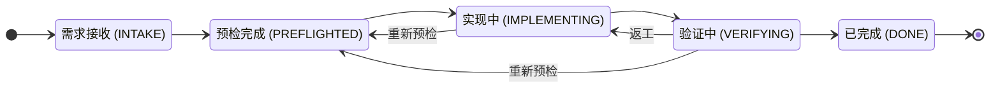

# State-machine workflow

## Contents

- [Controller protocol](#controller-protocol)
- [Command templates](#command-templates)
- [Flow selection](#flow-selection)
- [Legal state order](#legal-state-order)
- [Per-transition confirmation](#per-transition-confirmation)
- [Lite flow](#lite-flow)
- [Artifact lifecycle](#artifact-lifecycle)
- [Intake and repository preflight](#intake-and-repository-preflight)
- [Baseline gate](#baseline-gate)
- [Dual-index routing](#dual-index-routing)
- [Impact analysis and impact gate](#impact-analysis-and-impact-gate)
- [Impact reassessment](#impact-reassessment)
- [Route gate](#route-gate)
- [Workspace gate](#workspace-gate)
- [Planning gate](#planning-gate)
- [Replanning](#replanning)
- [Implementation and verification](#implementation-and-verification)
- [Independent review and finalization](#independent-review-and-finalization)
- [Human gates](#human-gates)

## Controller protocol

Use `<plugin-root>/scripts/dev_flow.py` as the sole writer of workflow state. It keeps state outside target repositories and exposes these commands:

```text
start  show  recover-quarantine  recover-atomic-write  list  scope
preflight  baseline  record-index  record-artifact  set-route  approve
transition  prepare-workspace  record-test  review-snapshot  cancel
```

`recover-atomic-write` also takes no task ID or `--expected-revision`: it resolves an interrupted atomic state write, which is exactly the failure that can block the write a revision check would need. See [recovery](recovery.md).

`scope` is the only command that reads and writes plugin configuration rather than task state, so it takes no task ID or `--expected-revision`. It reports the directories where this plugin is active and, when `start` returns `OUT_OF_SCOPE`, is the supported way to widen that scope. Changing the scope is the user's decision: present the current `summary` and the rejected path, and run a `scope` mutation only after an explicit choice.

Read each command's installed help for its exact arguments. Controller command names, options, help, stable IDs, error codes, and first-party `error.message` text stay in English. User-facing hook/skill prompts and returned display fields such as `status_name`, `flow_name`, `workspace_strategy_name`, workflow names, and choice labels use Chinese. Every mutation of an existing task requires its task ID and the revision currently returned by `show` as `--expected-revision`. Parse the one JSON object written to stdout, branch on `error.code` rather than message text, and replace the in-memory revision with the returned revision. On a revision conflict, reload with `show`, reconcile completed work, and decide the next action; do not retry with a guessed revision.

Never edit state JSON manually. Record artifact paths with their content hashes, exact base commits, actual codebase-memory project identifiers, test commands/results, approvals, and review snapshot evidence through the matching controller command.

Resolve `<state-dir>` from the Dev Flow bootstrap/checkpoint context injected by the plugin hook. Resolve `<evidence-root>` as `<state-dir>/tasks/<task-id>/artifacts/`. Create it as needed. Save impact reports, direct contracts, review reports, and optional captured test output there by default; never place workflow evidence in a business source repository. Keep the OpenSpec change directory at the CLI-reported `changeRoot` inside the managed implementation worktree and record that directory in place as `openspec-plan`.

## Command templates

Let `<ctl>` mean the exact ordered argument prefix injected by the plugin hook: `<injected-interpreter> <absolute-controller-path> --data-dir <state-dir>`. Preserve those three absolute values and their argument boundaries; do not substitute another interpreter, reparse the displayed bootstrap/resume command through a different shell, omit `--data-dir`, or rely on `PLUGIN_DATA` reaching the execution surface. Repeat `--repo` for multiple repositories and reload with `show` after each successful state mutation.

```text
<ctl> list --active-only
<ctl> show --task <task-id>
<ctl> recover-quarantine --task <task-id> --expected-revision <revision>
<ctl> recover-atomic-write [--path <destination>] [--apply] [--resolve <keep-current|restore-rollback>] [--rollback-sha256 <sha256>]
<ctl> scope [--check <directory>] [--add <directory>] [--add-exclude <directory>] [--remove <directory>] [--remove-exclude <directory>] [--mode <all|allowlist>] [--clear]
<ctl> start --requirement <text> --repo <path> [--repo <path> ...] --workspace-strategy <in-place|branch|worktree>
<ctl> preflight --task <task-id> --expected-revision <revision> [--repo <id> ...] [--remote <name>] [--base <branch>] --preview
<ctl> preflight --task <task-id> --expected-revision <revision> [--repo <id> ...] [--remote <name>] [--base <branch>] --confirm-preview <token> [--accept-evidence-refresh]
<ctl> approve --task <task-id> --expected-revision <revision> --gate <gate> --note <note> [--artifact-sha256 <sha256>]
<ctl> approve --task <task-id> --expected-revision <revision> --gate baseline-fetch --note <note> [--allow-fetch] [--allow-dirty]
<ctl> approve --task <task-id> --expected-revision <revision> --gate lite --note <note> [--allow-dirty]
<ctl> baseline --task <task-id> --expected-revision <revision> --materialize [--fetch]
<ctl> record-index --task <task-id> --expected-revision <revision> --role baseline --repo <id> --commit <base-sha> --index-id <project-id> --metadata-json <json-object>
<ctl> record-artifact --task <task-id> --expected-revision <revision> --path <file-or-directory> --kind <kind> [--metadata-json <json-object>]
<ctl> set-route --task <task-id> --expected-revision <revision> --route <direct|openspec> --reason <reason>
<ctl> prepare-workspace --task <task-id> --expected-revision <revision> [--branch <branch>] [--path <single-repo-task-path>] [--workspace-path <repo>=<absolute-path> ...] [--workspace-branch <repo>=<branch> ...] [--dry-run]
<ctl> approve --task <task-id> --expected-revision <revision> --gate workspace --note <note> --artifact-sha256 <workspace-plan-sha256>
<ctl> prepare-workspace --task <task-id> --expected-revision <revision> [the exact approved global/per-repository options] --execute
<ctl> record-index --task <task-id> --expected-revision <revision> --role workspace --repo <id> --index-id <project-id> --metadata-json <json-object>
<ctl> transition --task <task-id> --expected-revision <revision> --to <state> [--note <note>]
<ctl> record-test --task <task-id> --expected-revision <revision> [--repo <id> ...] --name <name> --command <executed-command> --exit-code <code> [--output <file>]
<ctl> review-snapshot --task <task-id> --expected-revision <revision>
<ctl> record-artifact --task <task-id> --expected-revision <revision> --kind review-report --path <review-report> --verdict <PASS|CONDITIONAL|FAIL>
<ctl> cancel --task <task-id> --expected-revision <revision> --reason <reason>
```

For new `start` calls, pass only `--workspace-strategy`; it uniquely derives the stored flow. The optional `--flow` argument exists only as a compatibility consistency assertion for older callers: a matching value is accepted, while a mismatch fails instead of overriding the strategy.

Treat `prepare-workspace` as plan recording unless `--execute` is present. It never changes Git during planning, but it records a deterministic `workspace-plan` artifact and normally increments the revision. Treat `record-test` as a recorder only: run the stated command yourself, observe its exit code, then record exactly what ran. Never use controller metadata to claim an action occurred when it did not.

## Flow selection

Every task records either `full` or `lite`, derived uniquely from its required `--workspace-strategy`: `in-place` and `branch` derive `lite`, while `worktree` derives `full`. The derived flow and selected strategy are immutable for the task's lifetime, like the requirement and repository set. Keep stable IDs in controller calls and state, but use these Chinese names in every user-facing choice and progress report:

- **完整流程 (`full`)**: the complete pipeline below — baseline, dual indexes, impact analysis, route choice, managed worktrees, approved planning, and independent review. Required for cross-repository, public-contract, migration, security, infrastructure, architecture-sensitive, or materially ambiguous work, and whenever isolation from the user's checkout matters.
- **精简流程 (`lite`)**: an in-place path for a bounded, low-risk, well-understood change — a small bug fix, a localized tweak, a docs or config edit — where creating analysis and implementation worktrees would cost more than the change itself. It keeps preflight evidence, one explicit human gate, guarded transitions, and test-currency enforcement, and skips everything else. See [Lite flow](#lite-flow).

Before `start`, ask in Chinese and wait for one explicit work-mode choice:

1. **使用当前分支（精简流程）** — use `--workspace-strategy in-place`.
2. **新建并切换分支（精简流程）** — inspect the exact current branch, `HEAD`, and status; present a direct local branch name that is neither protected nor the resolvable remote default/base, plus the exact local `git switch -c <branch>` command; create/switch it only after approval and before `start`; then use `--workspace-strategy branch`. `start` rejects symbolic branch refs and binds the resulting branch and `HEAD`. Both stay exact until the first confirmed all-repository preflight; afterwards the branch remains immutable, while a new `HEAD` requires a fresh all-repository preflight pair and lite approval. This choice never authorizes `fetch`, `pull`, stash, reset, or cleanup.
3. **创建独立工作树（完整流程）** — use `--workspace-strategy worktree`; the later workspace plan and approval still govern actual creation.

Recommend a mode from the request's apparent scope and risks, but never call `start`, switch a branch, or create a worktree before the user chooses. `start` rejects a missing `--workspace-strategy`, so the selected mode is recorded for audit and remains immutable. Repeatable `--protected-branch` values always extend and never replace the built-in `main`/`master`/`trunk` set. Those protected names prevent branch-mode binding and direct commits, but do not prohibit local edits under the explicitly selected `in-place` mode. When a lite task turns out to need impact analysis, isolation, or planning rigor, stop and ask the user to cancel/replace it as a full task; there is no in-place upgrade, because the full flow's evidence chain starts at baseline approval.

## Legal state order

A full task advances only through this order:

Every solid arrow below is a separate checkpoint: before crossing it, show the Chinese source/target and all remaining main-flow states, then wait for confirmation bound to that one edge.

```mermaid
stateDiagram-v2
    direction LR
    state "需求接收 (INTAKE)" as INTAKE
    state "预检完成 (PREFLIGHTED)" as PREFLIGHTED
    state "基线就绪 (BASELINED)" as BASELINED
    state "索引完成 (INDEXED)" as INDEXED
    state "影响评审 (IMPACT_REVIEW)" as IMPACT_REVIEW
    state "路线已批准 (ROUTE_APPROVED)" as ROUTE_APPROVED
    state "工作区就绪 (WORKSPACE_READY)" as WORKSPACE_READY
    state "方案规划 (PLANNING)" as PLANNING
    state "实现中 (IMPLEMENTING)" as IMPLEMENTING
    state "验证中 (VERIFYING)" as VERIFYING
    state "独立审查 (REVIEWING)" as REVIEWING
    state "交付确认 (FINALIZING)" as FINALIZING
    state "已完成 (DONE)" as DONE

    [*] --> INTAKE
    INTAKE --> PREFLIGHTED
    PREFLIGHTED --> BASELINED
    BASELINED --> INDEXED
    INDEXED --> IMPACT_REVIEW
    IMPACT_REVIEW --> ROUTE_APPROVED
    ROUTE_APPROVED --> WORKSPACE_READY
    WORKSPACE_READY --> PLANNING
    PLANNING --> IMPLEMENTING
    IMPLEMENTING --> VERIFYING
    VERIFYING --> REVIEWING
    REVIEWING --> FINALIZING
    FINALIZING --> DONE
    DONE --> [*]
```



```text
INTAKE
  -> PREFLIGHTED
  -> BASELINED
  -> INDEXED
  -> IMPACT_REVIEW
  -> ROUTE_APPROVED
  -> WORKSPACE_READY
  -> PLANNING
  -> IMPLEMENTING
  -> VERIFYING
  -> REVIEWING
  -> FINALIZING
  -> DONE
```

A lite task uses the shorter state machine below; the controller rejects every full-only state, command, and gate for it with `FLOW_MISMATCH` or `INVALID_TRANSITION`.



`BLOCKED` and `CANCELLED` are exceptional states. Use `BLOCKED` only through controller-supported recovery when progress cannot safely continue; retain the last good evidence and explain the unblock condition. Use `cancel` only after explicit user instruction. Do not treat `DONE` or `CANCELLED` as resumable implementation states.

Do not skip a state even if the implementation is small. The supported way to keep genuinely small work light is choosing the lite flow at `start`, not bypassing gates inside a full task; within a full task, keep low-risk work lightweight by making the evidence and direct contract concise. Use only the supported backward paths described below: return to `PLANNING` for replanning or to `INDEXED` for impact reassessment, always with a reason.

Prefer the domain commands that advance automatically: applying a confirmed all-repository preflight preview enters `PREFLIGHTED`; any successful `baseline` (with optional `--fetch` and/or `--materialize`) enters `BASELINED`; the last required `record-index` enters `INDEXED`; `set-route` enters `IMPACT_REVIEW`; `approve --gate route` enters `ROUTE_APPROVED`; all-repository `prepare-workspace --execute` enters `WORKSPACE_READY`; and `review-snapshot` enters `REVIEWING`. Use `transition` for the remaining legal edges and supported rework/blocking paths, not to duplicate those automatic changes.

## Per-transition confirmation

Treat every explicit or automatic `status` change as a separate user decision. Immediately before the state-changing command, reload with `show`, then ask in Chinese using this compact shape:

```text
即将切换：<当前中文状态>（<ID>） → <目标中文状态>（<ID>）
本次动作：<command/action>
后续流程：<目标状态之后的全部中文主流程；终态写“无”>
是否执行这一次状态切换？
```

Wait for an explicit answer. Bind the answer to the displayed task ID, current revision, source state, target state, and single action. Any revision or source-state change invalidates it. Do not reuse approval for another edge, and do not interpret a broad request such as “继续”“完成任务” or the original implementation request as approval for every later transition.

The commands that can change `status` are:

- `preflight --confirm-preview <token>`: first run `preflight --preview`, which commits no task state, performs no complete worktree fingerprint, and returns one `transition_preview` whose token binds the exact status decision plus a lightweight observation. If it changes status, confirm that reported edge. Confirm then captures complete evidence. Decision drift fails with `PREFLIGHT_PREVIEW_STALE`, so a changed decision requires a new preview and state-edge confirmation. Observation-only drift leaves the decision and token reusable but fails with `PREFLIGHT_EVIDENCE_REFRESH_REQUIRED`; inspect the returned current evidence, obtain explicit acceptance, and retry the same token with `--accept-evidence-refresh`. A selected-repository pair only records evidence and keeps the current status. Before any preflight status transition, run a final all-repository pair so complete evidence for every repository is captured and bound; a `PREFLIGHTED` task rejects partial refreshes.
- `baseline` with any supported option combination (including bare `baseline`, `--fetch`, and/or `--materialize`): → `BASELINED`.
- the final required `record-index --role baseline`: → `INDEXED`; earlier per-repository records do not change status.
- `set-route`: → `IMPACT_REVIEW`.
- `approve --gate route`: → `ROUTE_APPROVED`. Route-gate approval and permission to cross this state edge must both be explicit; present them together but do not imply later approval.
- `prepare-workspace --execute`: → `WORKSPACE_READY`.
- `review-snapshot`: → `REVIEWING`.
- `transition`: → its requested target, including rework and `BLOCKED`. It cannot replace domain commands: in particular, `INTAKE` or a preflight-phase `BLOCKED` state may enter `PREFLIGHTED` only through a confirmed all-repository preflight pair.
- `cancel`: → `CANCELLED`.

Use these Chinese labels while retaining the stable IDs in commands and evidence:

| Stable ID | Chinese name |
|---|---|
| `full` | 完整流程 |
| `lite` | 精简流程 |
| `INTAKE` | 需求接收 |
| `PREFLIGHTED` | 预检完成 |
| `BASELINED` | 基线就绪 |
| `INDEXED` | 索引完成 |
| `IMPACT_REVIEW` | 影响评审 |
| `ROUTE_APPROVED` | 路线已批准 |
| `WORKSPACE_READY` | 工作区就绪 |
| `PLANNING` | 方案规划 |
| `IMPLEMENTING` | 实现中 |
| `VERIFYING` | 验证中 |
| `REVIEWING` | 独立审查 |
| `FINALIZING` | 交付确认 |
| `DONE` | 已完成 |
| `BLOCKED` | 已阻塞 |
| `CANCELLED` | 已取消 |

## Lite flow

A lite task works directly inside the user's selected source-checkout branch. `workspace.strategy` records whether the user chose `in-place` (the current branch) or `branch` (a newly created/switched branch before `start`). It has no baseline, analysis worktree, controller-bound codebase-memory index, route, managed implementation worktree, plan artifact, or controller-enforced independent review. `show.index_selection.selected_role` is always `none`; use codebase-memory ad hoc for navigation if helpful, outside the evidence chain. The compensating controls are the preflight evidence chain, one explicit human gate, per-transition confirmation, and the same fingerprint-bound test currency the full flow enforces.

Run it in this order:

1. **Preflight.** Call `preflight` exactly as on the full flow. The same blockers fail closed (detached `HEAD`, conflicts, active operations, hidden index flags, content filters); dirty files pause the flow and are preserved, never absorbed.
2. **Lite gate.** Present the requirement plus each repository's branch, `HEAD`, and exact working-tree evidence, and obtain explicit approval to change these checkouts in place. Record it as `approve --gate lite --note <note>`, adding `--allow-dirty` only when the user explicitly accepts working around the exact recorded dirty snapshot. The approval binds a hash of the complete per-repository branch/`HEAD`/working-tree evidence, and every later `preflight` clears it because that evidence may have changed.
3. **Implement.** Call `transition --to IMPLEMENTING`. The controller verifies live that every repository still matches the approved branch, `HEAD`, and working-tree fingerprint; drift fails closed with `CHECKOUT_DRIFT` or `PREFLIGHT_WORKTREE_CHANGED` and requires a fresh preflight and approval. Keep edits within the approved scope. The current branch must never change mid-task; the controller re-checks branch identity at every later gate.
4. **Verify.** Call `transition --to VERIFYING`, run the appropriate checks yourself, and record each with `record-test` exactly as on the full flow. Lite test records bind the current lite approval's unique ID instead of a plan hash: a re-approval invalidates older results, and each repository's latest result per test identity must pass and match the current worktree fingerprint before `DONE`.
5. **Finish.** Call `transition --to DONE` only after presenting the change summary. Commit, push, and PR creation remain separate explicitly authorized actions; on protected branches the hook additionally blocks direct commits.

Supported backward paths: `VERIFYING -> IMPLEMENTING` for rework, and `IMPLEMENTING/VERIFYING -> PREFLIGHTED` with a required `--note` when the checkout drifted or the change outgrew the approved scope. Reopening scope leads through a fresh `preflight` (which records the now-dirty tree) and a new `approve --gate lite --allow-dirty` decision; tests recorded under the earlier approval become historical evidence only. If the request stops being bounded and low-risk, stop and replace the task with a full task after explicit user direction.

## Artifact lifecycle

Record gate artifacts only in their enforced states:

| Artifact kind | Recording state | Bound gate |
|---|---|---|
| `impact` | `INDEXED` or `IMPACT_REVIEW` | `route` |
| `workspace-plan` | Automatically from `prepare-workspace` in `ROUTE_APPROVED` or `WORKSPACE_READY` | `workspace` |
| `direct-contract` | `PLANNING` | `plan` |
| `openspec-plan` | `PLANNING` | `plan` |
| `review-report` | `REVIEWING`, after a snapshot | `review` |

Treat every recorded path as immutable audit evidence. Before approval and whenever a downstream gate is used, the controller hashes the latest artifact again. On `ARTIFACT_CHANGED`, do not approve or continue. In the artifact's legal state, preserve the revised content as a newly recorded artifact and bind a new approval. For a plan changed after planning, use replanning. For an impact report that legitimately needs revision after route approval, use impact reassessment; restore the exact approved content instead when the change was accidental.

## Intake and repository preflight

At `INTAKE`, normalize the requested behavior and enumerate every repository that may change. Pass every path and the selected `--workspace-strategy` to one `start` call; the controller resolves Git roots, removes duplicates, and derives the flow. Preview preflight without `--repo` to cover all repositories at once. Preview collects only lightweight identity, decision, blocker, and worktree-summary inputs; it deliberately does not compute the complete fingerprint. Selected preview/apply pairs are allowed for incremental evidence collection, but they never change status; reload the revision after each and finish with a new all-repository preview/apply pair that captures complete evidence for every repository. Use `--remote` or `--base` only for an explicit override, and repeat the identical selection and overrides with `--confirm-preview`.

If confirm returns `PREFLIGHT_EVIDENCE_REFRESH_REQUIRED`, its `details` identifies the current observation and states that the same token is reusable. Inspect that evidence and ask the user to accept the refreshed observation; retry the same selection, overrides, revision, and token with `--accept-evidence-refresh`. This acceptance does not authorize a different status decision. If confirm instead returns `PREFLIGHT_PREVIEW_STALE`, the decision changed before or during complete capture: discard the token, rerun preview, and obtain a new state-edge confirmation whenever `changes_status` is true.

Inspect the returned per-repository evidence:

- canonical root, remote URLs, current branch, `HEAD`, and the remote's configured default branch;
- staged, unstaged, untracked, conflicted, rebasing, merging, or cherry-picking state;
- repository-local instructions and test/build entry points.

Do not assume `main` or `master`. Do not fetch merely to make the remote appear current. Report unavailable remote/default-branch evidence honestly.

Let controller-detected conflicts, detached `HEAD`, unresolved bases/remotes, active Git operations, tracked paths marked `assume-unchanged`/`skip-worktree`, or tracked clean/process filters enter a fail-closed blocker. Index flags and filters—including sparse checkouts and Git LFS—can hide or transform real bytes from status/diff; the current controller does not treat them as complete evidence. Do not clear flags, expand a sparse checkout, or remove filters automatically. Also pause on dirty files even when the controller reports the repository technically ready; never stash, reset, clean, or absorb those changes automatically. Normally ask the user to resolve them and rerun `preflight`. If the user explicitly chooses to preserve and work around the exact ordinary dirty snapshot, retain that decision for the structured baseline approval below; hidden index flags/content filters are not covered by `--allow-dirty`.

## Baseline gate

Present one table covering repository, resolved remote name and URL, base branch, candidate source ref/SHA, preflight `HEAD`, exact working-tree fingerprint/dirt, and whether a fetch is proposed. Ask the user to approve the repository scope plus baseline fetch/materialization. Record this as `approve --gate baseline-fetch` before any `baseline` call; the approval binds a hash of the complete per-repository remote/base-candidate/HEAD/working-tree evidence, and the controller rejects even a no-fetch/no-materialize baseline without it. Include `--allow-fetch` only when the user explicitly authorizes network fetching. Include `--allow-dirty` only when the user explicitly authorizes proceeding around the exact recorded dirty snapshot; without it, any dirt is rejected. These structured flags override neither one another nor free-text notes. Immediately before baseline fetch or pinning, the controller compares each live remote URL and working-tree fingerprint with the approved preflight values and stops on drift. Without `--fetch`, the live candidate base ref must still resolve to the exact approved SHA. When fetching is authorized, it fetches the approved effective URL and base branch with an explicit source/destination refspec while disabling repository hooks, custom upload-pack/transport commands, credential and askpass helpers, pruning, and automatic maintenance; repository-specific `remote.<name>.fetch` mappings cannot silently omit the base. If the remote requires an external authentication or SSH helper, ask the user to fetch it under their normal Git policy, rerun `preflight`, and approve the resulting no-fetch baseline. Every subsequent `preflight` write clears this approval because remote, base candidate, `HEAD`, or working-tree evidence may have changed, so present the refreshed evidence and obtain a new approval.

Use the returned `base_sha` and `analysis_workspace.path` for every repository. Verify that each analysis workspace is detached at its pinned base commit and contains no user work before analysis. If a baseline or materialized path later moves or disappears, do not silently update it: report drift and repeat the gate or retain/recreate the exact recorded baseline through supported recovery.

## Dual-index routing

Read [index-routing.md](index-routing.md) before indexing or querying. Each repository has an immutable baseline index over its detached analysis worktree and a refreshable workspace index over its current-generation implementation worktree. Codebase-memory does not choose between them: every query must pass the controller-selected project's exact returned ID explicitly.

Use baseline projects through route/workspace approval. After workspace creation, create and record the workspace project before entering `PLANNING`, and refresh it after plan or implementation changes before entering `IMPLEMENTING`, `VERIFYING`, or generating the review snapshot. Never mix baseline and workspace project IDs in one cross-repository analysis, never mix workspace generations, and never silently fall back to baseline when a workspace project is missing or stale.

## Impact analysis and impact gate

Invoke `$analyze-change-impact` with the normalized requirement and, for every repository, its source path, exact `base_sha`, and controller-returned `analysis_workspace.path`. Never index the user's dirty or feature-branch worktree as though it were the pinned baseline.

Build and record the evidence:

1. For every repository, run `index_repository` through the impact skill with `repo_path=analysis_workspace.path`, the controller-recommended baseline name, and `persistence=false`. Call `record-index --role baseline` for that repository with `--commit <base_sha>`, the exact returned project identifier as `--index-id`, and the index mode plus `persistence: false` in `--metadata-json`.
2. For multiple repositories, ensure all normal indexes are fresh before cross-repository intelligence runs.
3. Save the completed report under `<evidence-root>`. Call `record-artifact --kind impact --path <report>` and retain the returned SHA-256. The controller also binds the artifact to a digest of every repository's current index record and degraded provenance.
4. Keep the task at `INDEXED` until the report covers every approved repository or explicitly records degraded coverage.

Present the report, route recommendation, unknowns, and degraded evidence. `set-route` is legal only after a current impact report exists. Obtain an explicit user decision before routing. If any repository is indexed again, the prior impact binding becomes stale: rerun dependent analysis and record a new report before route selection. Recording a corrected impact while still in `IMPACT_REVIEW` clears the prior route selection, so present the new report and ask again. If missing evidence could change scope or safety, resolve it or ask whether to proceed with the named limitation; do not hide it.

If indexing fails after the impact skill exhausts its safe fallback, do not invent an index ID. Produce the degraded source-backed report as an unrecorded draft and ask whether to continue. After explicit acceptance, record `approve --gate impact-degraded` with a note describing the limitation and retain its returned `approval_id`. Then call `record-index --role baseline` for each affected repository without `--index-id`, using `--metadata-json` with `status: "failed"`, a non-empty `error`, the requested mode, `fallback_coverage`, and `impact_degraded_approval_id` exactly matching that current approval. The controller rejects missing, stale, or malformed degraded provenance. Once all repository attempts move the task to `INDEXED`, record the final report as `impact`. This records failure provenance so the state machine can proceed; it does not reclassify the repository as successfully indexed. Workspace indexes cannot use this degraded path because downstream implementation navigation must not silently fall back to baseline evidence.

## Impact reassessment

Return from `ROUTE_APPROVED`, `WORKSPACE_READY`, `PLANNING`, `IMPLEMENTING`, `VERIFYING`, `REVIEWING`, or `FINALIZING` to `INDEXED` when new baseline-index evidence changes the impact conclusions, the route choice changes, or the original immutable requirement was previously analyzed incorrectly. Call `transition --to INDEXED --note <reason>`. The controller clears the selected route plus route/workspace/plan/review approvals and review snapshots, retires every recorded implementation workspace and its workspace-index record into history, clears the active workspace indexes, and advances the workspace generation while preserving baselines, baseline-index provenance, artifacts, tests, workspace history, and event history. Retired physical worktrees and external codebase-memory projects are left untouched for explicit later cleanup but are no longer current workflow workspaces/indexes. Both the requirement text and configured repository set are immutable for a task. If the user changes the requirement or acceptance criteria, or reassessment adds/removes a repository, stop and obtain the user's decision to cancel/replace the task rather than pretending the old evidence chain governs the new request.

Impact reassessment increments an impact generation. Even when the index digest is unchanged, every older impact artifact belongs to the prior generation and cannot be routed or approved. Create and record a new `impact` under `<evidence-root>`, present it, select/approve the route again, record and approve a new deterministic workspace plan covering every configured repository, and execute that exact full plan in the new workspace generation. Do not copy, cherry-pick, reset, or otherwise migrate changes from a retired workspace without presenting the exact operation and obtaining explicit user direction. Return to `PLANNING`, record/approve a new direct contract or OpenSpec plan, and proceed through implementation and verification. Old tests remain historical evidence only: record a new passing result for every configured repository after the current plan approval because test records are bound to the current plan hash and unique approval ID.

## Route gate

Offer exactly these implementation routes:

- `direct`: use a compact approved contract for a bounded, reversible, well-understood change;
- `openspec`: use project-generated OpenSpec workflow guidance for cross-repository, public-contract, migration, security, infrastructure, architecture-sensitive, or materially ambiguous work.

Recommend one from the impact report, but let the user choose. Call `set-route` with the explicit choice and required `--reason`; this enters `IMPACT_REVIEW`. Then bind approval to the recorded impact report with `approve --gate route --artifact-sha256 <impact-sha256>`; this enters `ROUTE_APPROVED`. Never silently downgrade OpenSpec to direct when its CLI or artifacts fail.

## Workspace gate

Both routes require a task-specific branch and an independent, task-owned linked worktree per repository before planning or implementation edits. Every `prepare-workspace` plan must cover the task's complete repository set; a subset is rejected. The destination cannot overlap a source checkout, any Git-registered worktree (including unrelated user worktrees), any task's analysis worktree, the controller's task/registry namespaces, or a managed workspace namespace belonging to another task/generation. The only existing-path exception is an exact approved/claimed path that passes the strict recorded-workspace or clean partial-side-effect recovery checks. Call `prepare-workspace` without `--execute` to generate and record the deterministic default `workspace-plan`. Use global `--branch` for a common override, `--path` only for a single-repository task, or repeat `--workspace-path <repo>=<absolute-path>` / `--workspace-branch <repo>=<branch>` when one repository in a multi-repository plan needs a collision-free destination or distinct branch. Duplicate, unknown, relative-path, overlapping, protected-branch, reserved-state, cross-task-owned, or retired path/branch overrides are rejected under the controller's global ownership lock. The plan evidence includes the current workspace generation, so reassessment can never reuse an older plan hash even when custom paths and branches look identical. Planning does not change Git, but a new plan records an artifact, clears any older workspace approval, increments the revision, and returns `plan_artifact.sha256`. Repeating the same intact plan in the same generation returns `unchanged` without incrementing the revision.

Show every path, branch, base SHA, and plan hash. After explicit approval, call `approve --gate workspace --artifact-sha256 <workspace-plan-sha256>` and reload the new revision. Then call `prepare-workspace --execute` with exactly the same full-repository, branch, and path options that produced the approved plan. Any difference fails with `WORKSPACE_PLAN_MISMATCH`; record and approve a new dry-run plan instead of improvising. Use returned paths as the only implementation worktrees. On resume, an existing but not-yet-recorded linked worktree may be reconciled only as a clean partial side effect when its canonical path, branch, exact base `HEAD`, common Git directory, and approved plan all match; any staged, unstaged, untracked, or ignored content blocks adoption. Checkout hooks are deliberately disabled while the controller creates an analysis or implementation worktree, and the controller then verifies that the resulting checkout is clean. Before every downstream state gate, the controller revalidates each recorded path, repository root, linked-worktree/common-directory relationship, task branch, and baseline ancestry. Treat drift as a blocker; never create a duplicate merely because the prior response was lost.

Immediately after all workspaces become ready, index every returned `workspace.path` with the current generation's recommended name and `persistence=false`, then call `record-index --role workspace` with each exact returned project ID. The controller binds each record to the approved workspace plan, canonical path, branch, current `HEAD`, generation, and complete Git fingerprint. A workspace index is required before `PLANNING`; recording only the baseline project does not satisfy this gate.

If branch or path names collide, pause and offer reuse only when identity and baseline match; otherwise ask for a new name. Never delete or overwrite the collision.

## Planning gate

After all workspaces are ready and every current workspace index is recorded, call `transition --to PLANNING`.

For the direct route, fill the direct-contract template linked from the main skill. Ensure it contains:

- goal and observable acceptance criteria;
- per-repository scope and explicit non-goals;
- intended files/symbols or components;
- test and verification commands;
- compatibility, migration, security, rollout, and rollback risks when relevant;
- implementation and deployment order for multiple repositories.

Save the contract under `<evidence-root>` and call `record-artifact --kind direct-contract --path <contract>`. Present it to the user and call `approve --gate plan --artifact-sha256 <contract-sha256>` only after explicit approval. Refresh and record every workspace index after any planning edits and before transitioning to `IMPLEMENTING`.

For the OpenSpec route, follow the OpenSpec route reference linked directly from the main skill rather than a fixed phase list. When the current workflow is apply-ready, call `record-artifact --kind openspec-plan --path <planning-root>/changes/<change-id>` so the controller recursively hashes the complete change directory. Present the apply-ready planning context and call `approve --gate plan --artifact-sha256 <openspec-plan-sha256>` only after explicit approval. Because OpenSpec artifacts live in the managed workspace and affect its fingerprint, refresh and record every workspace index after the apply-ready plan is final and before transitioning to `IMPLEMENTING`.

## Replanning

Return from `IMPLEMENTING`, `VERIFYING`, `REVIEWING`, or `FINALIZING` to `PLANNING` when implementation changes the approved direct contract or OpenSpec plan, an approved plan path changed, or review reveals a planning correction. Call `transition --to PLANNING --note <reason>` before recording a replacement plan artifact. This transition clears plan/review approvals and review snapshots.

Entering `PLANNING` creates a new planning generation. Revise the planning material only there, record a new `direct-contract` or `openspec-plan`, present the delta, and obtain a new plan approval. The controller binds that artifact to the current planning generation, route approval, workspace approval, and workspace-plan generation/hash in addition to its own content hash. An older artifact cannot be reapproved merely because its bytes are unchanged. Then transition through `IMPLEMENTING` and record a new passing result for every configured repository after that approval, even when some code fingerprints did not change; old test records are bound to the older plan. Repeat snapshot generation and independent review. Do not use replanning to rewrite the approved impact report or silently change the selected route.

## Implementation and verification

After the planning gate and a workspace-index refresh that covers the approved planning bytes, call `transition --to IMPLEMENTING`. Work solely in the recorded task worktrees and keep changes within the approved contract. The controller revalidates task ownership, Git identity, and workspace-index freshness at downstream gates; a detached, switched, moved, replaced, unrelated, or stale-index checkout is not accepted merely because its files match. When implementation reveals that the approved impact or contract incompletely covers the same immutable requirement, stop; update impact/planning evidence through the applicable route and obtain renewed approval before continuing. If the user changes the requirement/acceptance criteria or another repository must be added or removed, stop and replace the task after explicit user direction because requirement and repository membership are fixed at `start`.

Refresh and record every workspace index after implementation changes, then call `transition --to VERIFYING` and run the approved checks in the appropriate repository order. `record-test` never runs a command; call it only after execution with a stable logical `--name`, the exact command, observed exit code, applicable repositories, and optional output file. When an output file is supplied, keep it under `<evidence-root>` and do not edit or delete it: the controller records its path, size, and SHA-256 and revalidates those bytes at snapshot and finalization gates. Under the current plan approval, group records by repository plus the test identity formed from name and exact command: every group's latest result must pass and match the complete worktree/Git-identity fingerprint, and every repository needs at least one current passing group. A passing `lint` record cannot hide a later/current `integration` failure; rerun the same failed name and command successfully to supersede it. If the command legitimately changes, the old failed identity remains visible; return through replanning and obtain a new plan approval before adopting the replacement command instead of silently renaming the failed suite away. Each record must name the current plan artifact SHA-256 and bind the current plan approval's unique ID. Reapproving unchanged plan content still invalidates older tests. A single record may cover multiple repositories only when the executed command genuinely did so; add an aggregate orchestration command only when the project actually provides or needs one. Dirty content inside a Git submodule fails closed because a parent gitlink cannot prove or snapshot those nested bytes; make the submodule a configured repository and reach a clean submodule commit/pointer state through separately authorized actions before continuing. Never label an unrun or interrupted test as passing. Treat test-created source changes as part of the snapshot and either justify them or ask how to handle them.

Tests or formatters may change tracked or untracked bytes. After all checks finish, refresh and record every workspace index again before `review-snapshot`. The controller rejects a missing or stale workspace project instead of substituting the baseline project.

For OpenSpec, current generated verification guidance may provide supplementary evidence, but it does not replace independent review or determine the gate.

## Independent review and finalization

After every repository has a current passing record and before any further worktree change, call `review-snapshot` from `VERIFYING` without a repository filter. The controller writes committed, cached, unstaged, and untracked evidence for every repository and enters `REVIEWING`. Invoke `$review-dev-flow-change` in a fresh reviewer context when available, passing raw evidence rather than the implementer's conclusions:

- requirement, baselines, repositories, and worktrees;
- impact report and approved route contract or current OpenSpec artifacts;
- recorded tests and the complete committed/cached/unstaged/untracked snapshot.

Also pass each repository's current workspace project ID for discovery. The reviewer must query it explicitly and still treat source plus the controller snapshot as canonical evidence; the baseline project is only for separately labelled before-state comparisons.

Save the review report under `<evidence-root>` with `Verdict: PASS`, `Verdict: CONDITIONAL`, or `Verdict: FAIL` as its first non-empty line. Then call `record-artifact --task <task-id> --expected-revision <revision> --kind review-report --path <report> --verdict <PASS|CONDITIONAL|FAIL>` while still in `REVIEWING`. Pass exactly the independent reviewer's overall verdict; the controller parses the report and rejects a missing, duplicate, malformed, or conflicting verdict instead of trusting CLI metadata alone. Omit `--metadata-json` unless adding unrelated metadata: the controller automatically sets `artifact.metadata.review_snapshot_sha256` to the latest snapshot SHA-256 and stores the structured verdict. If explicitly supplying either key, it must match the latest snapshot and `--verdict`. Verify the returned bindings, present the report to the user, and handle the verdict:

- `FAIL`: the controller refuses review approval. Call `transition --to IMPLEMENTING` after reporting the findings, then reimplement, reverify, resnapshot, and re-review.
- `CONDITIONAL`: satisfy and re-review the named conditions, or obtain the user's explicit acceptance when policy permits; never reinterpret it as `PASS` silently. Only after acceptance, call `approve --gate review --artifact-sha256 <review-sha256> --accept-conditional`, then `transition --to FINALIZING`.
- `PASS`: obtain the user's explicit acceptance, call `approve --gate review --artifact-sha256 <review-sha256>` without `--accept-conditional`, and then `transition --to FINALIZING`.

Treat the review report, review approval, and latest snapshot as one immutable evidence set. The review approval records the report hash, snapshot hash, and structured verdict. Before `FINALIZING` and `DONE`, the controller rehashes the snapshot manifest, committed/cached/unstaged patches, untracked manifest/archive, and report; any missing or changed evidence blocks progress. Creating a newer snapshot invalidates the older report and approval; record a new report and obtain a new review approval.

At `FINALIZING`, summarize scope, artifacts, repository/branch/worktree paths, tests, review verdict, residual risks, and any requested next action. Call `transition --to DONE` only when required evidence is recorded and the user-required handoff is complete. Commit, push, PR creation, merge, OpenSpec archive, and worktree removal remain separate explicitly authorized actions.

## Human gates

Never infer approval from silence or from an earlier generic request. Require explicit approval for:

1. full versus lite flow selection at `start`;
2. repository scope plus baseline fetch/materialization;
3. accepting materially degraded impact coverage;
4. direct versus OpenSpec route selection;
5. branch/worktree creation plan;
6. direct contract or OpenSpec apply-ready plan;
7. material impact or contract corrections for the same immutable requirement discovered during implementation;
8. accepting the independent review verdict, including any allowed condition;
9. the lite gate: changing the exact recorded checkouts in place, including any dirty snapshot;
10. cancellation and any commit, push, merge, archive, or cleanup action.
